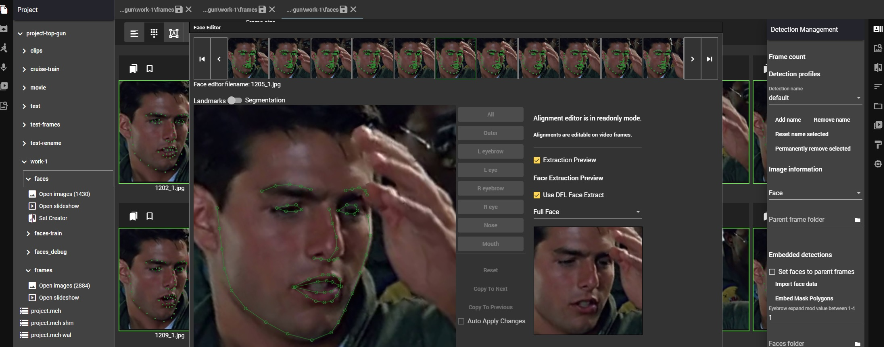

<h1 align="center">
  Machine Video Editor
</h1>

<h2 align="center">
  Graphical editor for a streamlined deepfake creation process from data gathering to compositing
</h2>

</img>

# Introduction

MVE is a free, community supported tool for deepfake project management from data gathering to compositing, it fully supports DeepFaceLab and data format, more supported projects are planned in the future.

Focus of MVE is project management, to have all your deepfake resources in a single project folder, and set data curating with tools for data scrapping, extracting, advanced sorting methods, set analysis, augmentation and manual face and mask editor tools.

MVE is currently not open source but may be in the future if it makes sense. This repository contains external open source projects that are used within the editor, projects are listed bellow.

## Documentation

Documentation and tutorials are still work in progress, current available tutorials are located in the discord server <a href="https://discord.gg/BSnt5Fv">https://discord.gg/BSnt5Fv</a>

## Download

Windows version <a href="https://drive.google.com/file/d/14q3opqe1C4v9eqBO9Zgz1CC9lNrSO4of/view?usp=sharing">https://drive.google.com/file/d/14q3opqe1C4v9eqBO9Zgz1CC9lNrSO4of/view?usp=sharing</a>

Linux version <a href="https://drive.google.com/file/d/153Pi4HsC7xsdHrKDa3K52vN2c7wV_CLC/view?usp=sharing"> https://drive.google.com/file/d/153Pi4HsC7xsdHrKDa3K52vN2c7wV_CLC/view?usp=sharing</a>

## Comuncation

Discord link <a href="https://discord.gg/BSnt5Fv">https://discord.gg/BSnt5Fv</a>

## Support development

Development of this application is not possible without the support of project backers. To contribute to the project become a backer on Patreon or if you prefer single payment donate via PayPal

Patreon <a href="https://www.patreon.com/machineeditor">https://www.patreon.com/machineeditor</a>

PayPal <a href="https://www.paypal.me/ognjenjaric">paypal.me/ognjenjaric</a> 

 

# External projects

MVE additionally use several open source projects or parts of them and they have their own licenses. External project code is available in this repository.

### External projects

DeepFaceLab and FaceSwap code snippets for data import/export and sorting

PySceneDetect for scene detection with a change to output scenes as text

Image scrappers bing, getty, google

LJNormalize normalization script

GPL code is handled as <a href="https://www.gnu.org/licenses/gpl-faq.en.html#MereAggregation">aggregate</a>. Script are executed via command line and their output is a file or text.

